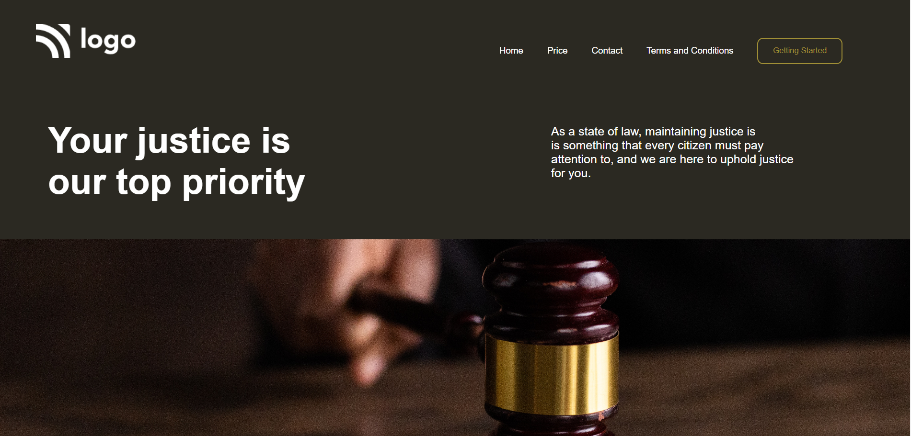

# Project 3 - Law Home Page

## Hi there, I am `Akshay Barapatre` Aspiring FullStack Javascript Developer   

---

## Short View of Website

---

 
## Project 3 [Live Link]([https://github.com/Aksh-007?tab=repositories](https://law-landing-home-page.netlify.app/))

-   Skills Gained in this project
    -  Learned about background Images
    -  Learned about flexbox

---

## Time taken to finish this project

-   5 hour taken to complete it.

